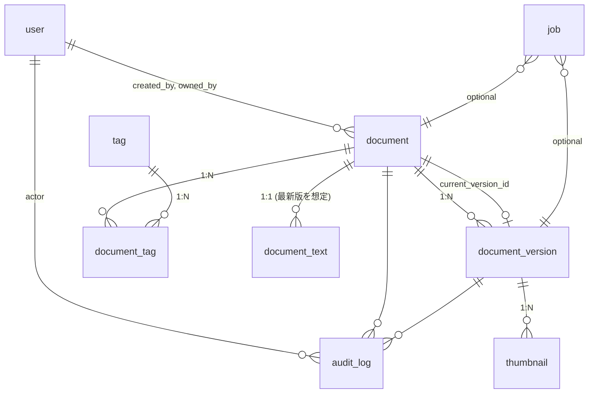

# ドキュメント管理システム DB 設計書

## 0. 概要

- RDBMS: PostgreSQL 15+
- マイグレーション: Flyway
- 文字コード: UTF-8
- タイムゾーン: UTC（アプリ表示時に JST へ変換）
- 主キー: `BIGSERIAL`（将来的に UUID へ移行可能）
- 命名規約: `snake_case`、テーブル単数形
- 監査・論理削除: 監査テーブルは別途用意、論理削除は要件なしのため未採用（削除は原則物理）

---

## 1. エンティティ一覧

- `user` … ユーザーアカウント
- `document` … 論理的な文書（タイトル・所有・公開状態など）
- `document_version` … ドキュメントの各版（MinIO オブジェクト, MIME, チェックサム）
- `tag` … タグマスタ
- `document_tag` … ドキュメントとタグの中間
- `document_text` … 抽出テキストと全文検索用 `tsvector`
- `job` … 非同期ジョブ（サムネイル生成・テキスト抽出）
- `thumbnail` … サムネイルメタ（複数サイズに対応）
- `audit_log` … 監査ログ（作成/更新/削除/ダウンロード等）

---

## 2. ER 図（論理）



---

## 3. テーブル定義

### 3.1 `user`

| 列名          | 型           | Not Null | デフォルト | 説明                    |
| ------------- | ------------ | -------- | ---------- | ----------------------- |
| id            | BIGSERIAL    | PK       |            | ユーザー ID             |
| username      | VARCHAR(50)  | NN, UQ   |            | 表示名/ログイン ID      |
| email         | VARCHAR(255) | NN, UQ   |            | メール（ログイン/通知） |
| password_hash | VARCHAR(255) | NN       |            | BCrypt 等               |
| role          | VARCHAR(20)  | NN       | `'USER'`   | `USER` / `ADMIN`        |
| created_at    | TIMESTAMPTZ  | NN       | now()      |                         |
| updated_at    | TIMESTAMPTZ  | NN       | now()      |                         |

#### Index

- `ux_user_username`
- `ux_user_email`

---

### 3.2 `document`

| 列名               | 型           | Not Null | デフォルト | 説明                                      |
| ------------------ | ------------ | -------- | ---------- | ----------------------------------------- |
| id                 | BIGSERIAL    | PK       |            | ドキュメント ID                           |
| title              | VARCHAR(255) | NN       |            | タイトル                                  |
| description        | TEXT         |          |            | 説明                                      |
| owned_by           | BIGINT       | NN       |            | 所有ユーザー（FK→user.id）                |
| current_version_id | BIGINT       |          |            | 現行版（FK→document_version.id）※遅延設定 |
| is_public          | BOOLEAN      | NN       | false      | 公開フラグ                                |
| created_by         | BIGINT       | NN       |            | 作成者（FK→user.id）                      |
| created_at         | TIMESTAMPTZ  | NN       | now()      |                                           |
| updated_at         | TIMESTAMPTZ  | NN       | now()      |                                           |

#### FK / Index

- FK: `(owned_by) → user(id)`, `(created_by) → user(id)`
- IX: `ix_document_title`, `ix_document_owned_by`, `ix_document_is_public`

---

### 3.3 `document_version`

| 列名            | 型           | Not Null | デフォルト | 説明                                  |
| --------------- | ------------ | -------- | ---------- | ------------------------------------- |
| id              | BIGSERIAL    | PK       |            | 版 ID                                 |
| document_id     | BIGINT       | NN       |            | FK→document.id                        |
| version         | INT          | NN       | 1          | 1,2,3…（`(document_id, version)` UQ） |
| object_key      | VARCHAR(512) | NN       |            | MinIO オブジェクトキー                |
| content_type    | VARCHAR(100) | NN       |            | MIME（例: application/pdf）           |
| size_bytes      | BIGINT       | NN       | 0          | バイト数                              |
| checksum_sha256 | CHAR(64)     | NN       |            | 整合性検証                            |
| uploaded_by     | BIGINT       | NN       |            | FK→user.id                            |
| uploaded_at     | TIMESTAMPTZ  | NN       | now()      |                                       |

#### 制約

- UQ: `(document_id, version)`
- IX: `ix_document_version_document_id`, `ix_document_version_uploaded_at`

#### 備考

- `document.current_version_id` は最新 `document_version.id` を指す。更新はトランザクション内で行う。

---

### 3.4 `tag`

| 列名 | 型          | Not Null | デフォルト |
| ---- | ----------- | -------- | ---------- |
| id   | BIGSERIAL   | PK       |            |
| name | VARCHAR(64) | NN, UQ   |            |

---

### 3.5 `document_tag`

| 列名        | 型     | Not Null | 説明           |
| ----------- | ------ | -------- | -------------- |
| document_id | BIGINT | NN       | FK→document.id |
| tag_id      | BIGINT | NN       | FK→tag.id      |

#### 3.5.1 制約

- PK: `(document_id, tag_id)`
- IX: `ix_document_tag_tag_id`

---

### 3.6 `document_text`

> 抽出テキストと全文検索。最新版のみ保持でも、全版保持でも OK（本設計は最新版のみ 1:1 運用を推奨）。

| 列名        | 型          | Not Null | 説明                                                               |
| ----------- | ----------- | -------- | ------------------------------------------------------------------ |
| document_id | BIGINT      | PK       | FK→document.id                                                     |
| version_id  | BIGINT      | NN       | FK→document_version.id（`document.current_version_id` と一致推奨） |
| raw_text    | TEXT        |          | OCR/抽出結果                                                       |
| text_tsv    | tsvector    |          | `generated` 列（`to_tsvector('simple', raw_text)` など）           |
| updated_at  | TIMESTAMPTZ | NN       | now()                                                              |

#### 3.6.1 Index

- GIN: `ix_document_text_tsv`（全文検索用）

---

### 3.7 `job`

> ElasticMQ（SQS 互換）連携のアプリ内部状態を保持（再送・監視・可視化）。

| 列名           | 型           | Not Null | デフォルト  | 説明                                   |
| -------------- | ------------ | -------- | ----------- | -------------------------------------- |
| id             | BIGSERIAL    | PK       |             | ジョブ ID                              |
| type           | VARCHAR(40)  | NN       |             | `GENERATE_THUMBNAIL` / `EXTRACT_TEXT`  |
| status         | VARCHAR(20)  | NN       | `'PENDING'` | `PENDING/IN_PROGRESS/SUCCEEDED/FAILED` |
| document_id    | BIGINT       |          |             | 関連ドキュメント                       |
| version_id     | BIGINT       |          |             | 関連版                                 |
| payload        | JSONB        |          |             | S3 キー、サイズ、オプション等          |
| sqs_message_id | VARCHAR(128) |          |             | ElasticMQ/SQS のメッセージ ID          |
| attempts       | INT          | NN       | 0           | リトライ回数                           |
| next_run_at    | TIMESTAMPTZ  |          |             | 再実行予定                             |
| created_at     | TIMESTAMPTZ  | NN       | now()       |                                        |
| updated_at     | TIMESTAMPTZ  | NN       | now()       |                                        |

#### 3.7.1 Index

- `ix_job_status_type`
- `ix_job_next_run_at`
- `ix_job_document_version`

---

### 3.8 `thumbnail`

| 列名       | 型           | Not Null | 説明                      |
| ---------- | ------------ | -------- | ------------------------- |
| id         | BIGSERIAL    | PK       |                           |
| version_id | BIGINT       | NN       | FK→document_version.id    |
| kind       | VARCHAR(20)  | NN       | `SMALL/MEDIUM/LARGE` など |
| object_key | VARCHAR(512) | NN       | MinIO オブジェクトキー    |
| width      | INT          |          |                           |
| height     | INT          |          |                           |
| created_at | TIMESTAMPTZ  | NN       | now()                     |

#### 3.8.1 Index

- UQ: `(version_id, kind)`

---

### 3.9 `audit_log`

| 列名        | 型          | Not Null | 説明                                     |
| ----------- | ----------- | -------- | ---------------------------------------- |
| id          | BIGSERIAL   | PK       |                                          |
| actor_id    | BIGINT      |          | 操作者（匿名 DL などで NULL 可）         |
| action      | VARCHAR(40) | NN       | `CREATE/UPDATE/DELETE/DOWNLOAD/LOGIN` 等 |
| document_id | BIGINT      |          | 対象ドキュメント                         |
| version_id  | BIGINT      |          | 対象版                                   |
| detail      | JSONB       |          | 付帯情報                                 |
| created_at  | TIMESTAMPTZ | NN       | now()                                    |

#### 3.9.1 Index

- `ix_audit_log_document`
- `ix_audit_log_actor_created_at`

---

## 4. オブジェクトストレージ（MinIO）キー設計

- 原則: `documents/{document_id}/{version}/original/{filename}`
- サムネイル: `documents/{document_id}/{version}/thumbnails/{kind}.{ext}`
- 衝突回避: `filename` にはアップロード時の拡張子を維持し、実体衝突回避はパス階層+version で担保
- 例:

  - 本体: `documents/101/3/original/contract.pdf`
  - サムネイル: `documents/101/3/thumbnails/SMALL.jpg`

---

## 5. 権限と整合性

- 作成: `document.created_by = current_user`
- 所有: `document.owned_by` によりアクセス制御（アプリ層で検査）
- 版更新トランザクション:

  1. `document_version` 挿入（version = `max + 1`）
  2. `document.current_version_id` を新規版に更新
  3. 必要に応じ `document_text` 更新（全文検索対象を最新へ）

- 削除:

  - ドキュメント削除時は子レコード（version/thumbnail/document_tag/document_text）を **ON DELETE CASCADE** またはアプリ層制御で同期削除

---

## 6. インデックス方針

- 参照頻度の高い列（`owned_by`, `is_public`, `title`）
- 絞り込み用に `created_at/updated_at`（期間検索）
- 全文検索: `document_text.text_tsv` に GIN
- 統計・監視: `job.status`, `job.type`, `job.next_run_at`

---

## 7. Flyway マイグレーション計画

- `V1__init_core.sql` … `user`, `document`, `document_version`, `tag`, `document_tag`
- `V2__text_search.sql` … `document_text` と `tsvector` 生成列、GIN インデックス
- `V3__jobs_and_thumbnails.sql` … `job`, `thumbnail`
- `V4__audit_log.sql` … `audit_log`
- `V5__constraints_and_indexes.sql` … FK/IX 最適化、UQ 追加
- `R__seed_minimal.sql` … 参照データ（管理者ユーザー、初期タグ）

---

## 8. サンプル DDL（抜粋：V1）

```sql
-- user
create table "user" (
  id bigserial primary key,
  username varchar(50) not null unique,
  email varchar(255) not null unique,
  password_hash varchar(255) not null,
  role varchar(20) not null default 'USER',
  created_at timestamptz not null default now(),
  updated_at timestamptz not null default now()
);

-- document
create table document (
  id bigserial primary key,
  title varchar(255) not null,
  description text,
  owned_by bigint not null references "user"(id),
  current_version_id bigint,
  is_public boolean not null default false,
  created_by bigint not null references "user"(id),
  created_at timestamptz not null default now(),
  updated_at timestamptz not null default now()
);

-- document_version
create table document_version (
  id bigserial primary key,
  document_id bigint not null references document(id) on delete cascade,
  version int not null,
  object_key varchar(512) not null,
  content_type varchar(100) not null,
  size_bytes bigint not null default 0,
  checksum_sha256 char(64) not null,
  uploaded_by bigint not null references "user"(id),
  uploaded_at timestamptz not null default now(),
  unique (document_id, version)
);

-- current_version 外部キー（循環参照回避のため後付け）
alter table document
  add constraint fk_document_current_version
  foreign key (current_version_id) references document_version(id);

-- tag
create table tag (
  id bigserial primary key,
  name varchar(64) not null unique
);

-- document_tag
create table document_tag (
  document_id bigint not null references document(id) on delete cascade,
  tag_id bigint not null references tag(id) on delete cascade,
  primary key (document_id, tag_id)
);

create index ix_document_title on document using btree (title);
create index ix_document_owned_by on document using btree (owned_by);
create index ix_document_is_public on document using btree (is_public);
```

---

## 9. サンプル DDL（V2：全文検索）

```sql
create table document_text (
  document_id bigint primary key references document(id) on delete cascade,
  version_id bigint not null references document_version(id) on delete cascade,
  raw_text text,
  text_tsv tsvector generated always as (to_tsvector('simple', coalesce(raw_text,''))) stored,
  updated_at timestamptz not null default now()
);

create index ix_document_text_tsv on document_text using gin (text_tsv);
```

---

## 10. サンプル DDL（V3：ジョブ/サムネイル）

```sql
create table job (
  id bigserial primary key,
  type varchar(40) not null,
  status varchar(20) not null default 'PENDING',
  document_id bigint references document(id) on delete set null,
  version_id bigint references document_version(id) on delete set null,
  payload jsonb,
  sqs_message_id varchar(128),
  attempts int not null default 0,
  next_run_at timestamptz,
  created_at timestamptz not null default now(),
  updated_at timestamptz not null default now()
);

create index ix_job_status_type on job (status, type);
create index ix_job_next_run_at on job (next_run_at);
create index ix_job_document_version on job (document_id, version_id);

create table thumbnail (
  id bigserial primary key,
  version_id bigint not null references document_version(id) on delete cascade,
  kind varchar(20) not null,
  object_key varchar(512) not null,
  width int,
  height int,
  created_at timestamptz not null default now(),
  unique (version_id, kind)
);
```

---

## 11. サンプル DDL（V4：監査）

```sql
create table audit_log (
  id bigserial primary key,
  actor_id bigint references "user"(id) on delete set null,
  action varchar(40) not null,
  document_id bigint references document(id) on delete set null,
  version_id bigint references document_version(id) on delete set null,
  detail jsonb,
  created_at timestamptz not null default now()
);

create index ix_audit_log_document on audit_log (document_id, version_id);
create index ix_audit_log_actor_created_at on audit_log (actor_id, created_at);
```

---

## 12. 運用・パフォーマンス

- トランザクション境界: 版追加と `current_version_id` 更新は同一 Tx
- バキューム: 定期的に `VACUUM (ANALYZE)`、全文検索テーブル更新後は `ANALYZE`
- バックアップ: `pg_dump`（日次）、MinIO バケットのバージョニング/レプリケーションはオブジェクト層で実施
- 大規模化対策:

  - ダウンロード統計等は別テーブルに集計（将来拡張）
  - `document_version` は `document_id` パーティションも検討可能（超大量時）
  - `document_text` の全文索引は言語別辞書（`simple`→`english/japanese`拡張）検討

---

## 13. サンプルシード（R\_\_seed_minimal.sql）

```sql
insert into "user"(username, email, password_hash, role)
values ('admin', 'admin@example.com', '{bcrypt hash}', 'ADMIN')
on conflict do nothing;

insert into tag(name) values ('invoice'), ('contract'), ('2025')
on conflict do nothing;
```

---

## 14. 移行・将来拡張

- UUID 化: 主キーを `uuid` に移行する計画（新列追加 → 影響箇所移行 → 切替）
- 共有リンク: 期限付きトークンを保持する `document_share_link`（将来）
- 組織/グループ: `organization`, `membership`, `acl` テーブル追加で RBAC 高度化
- 版のライフサイクル: アーカイブ/削除ポリシーを `document_version` にフラグ追加で拡張
